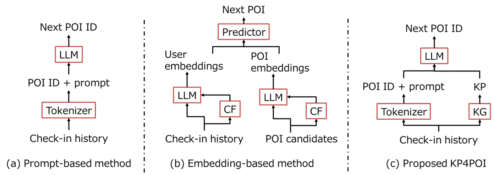
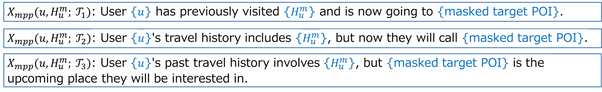
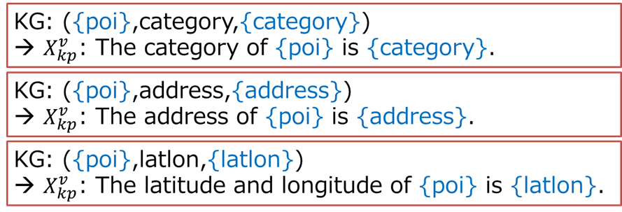
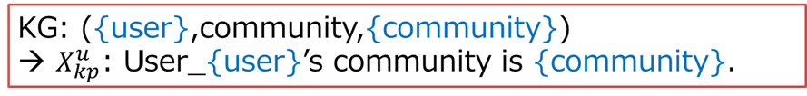

# KP4POI
Knowledge Prompting for Point of Interest (POI) Recommendation



This project builds upon **KP4SR**, which serves as our baseline model.

1. Clone [KP4SR](https://github.com/zhaijianyang/kp4sr) into this directory.  
2. Replace the corresponding files in the `scripts` and `src` directories with those provided here.

---

# Knowledge Prompts for POI Recommendation

## Masked Personalized Prompt


## Venue Knowledge Prompt


## User Knowledge Prompt


---

# Data Preprocessing
1. Convert the original data and add additional information.  
   - See the README in the `preprocess` directory.  
2. Prepare the data required by KP4SR.  
   - See the README in the `data` directory for experimental setup.  

---

# Model Training and Testing
Once the data are prepared, run:

```bash
bash run_poi.sh
```

---
#Citation
If you find this work useful, please cite our paper:

@inproceedings{
  author    = {Yuuki Tachioka},
  title     = {{KP4POI}: Efficient POI Recommendation on Large-Scale Datasets via Knowledge Prompting of Venues and Users},
  booktitle = {Proceedings of the ACM RecSys Workshop on Recommenders in Tourism @ 19th ACM Conference on Recommender Systems (RecSys 2025)},
  location  = {Prague, Czech Republic},
  month     = {September},
  year      = {2025},
}
